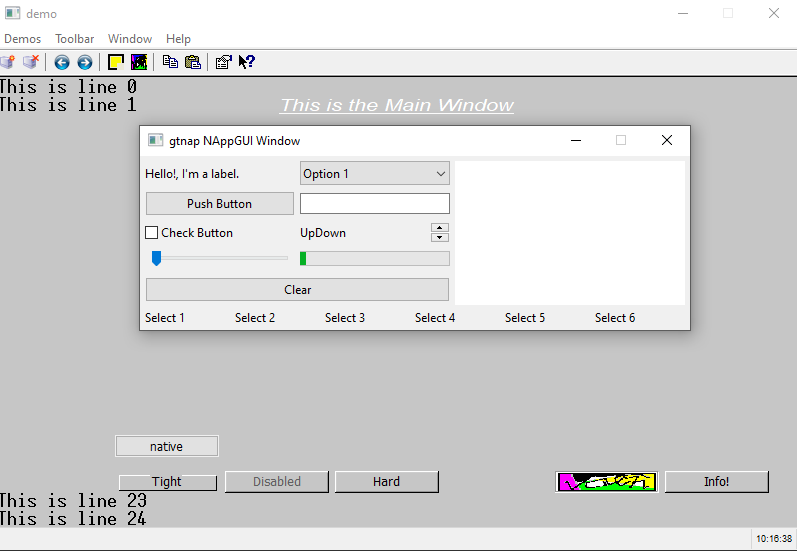

# gtnap

Harbour cross-platform video subsystem using NAppGUI-SDK
https://github.com/frang75/nappgui_src

This project is originally based on **gtwvw**.

## Getting started

### First steps

- Clone the harbour repository

```
git clone https://github.com/frang75/harbour_nappgui.git
```

- Compile harbour (VS 2012)

    * Open Developer Command Prompt for VS2012

    * Go to ``harbour_nappgui`` working copy

    * ``win-make``

    ```
    ! Building Harbour 3.2.0dev from source - https://harbour.github.io
    ! MAKE: win-make 4.1 sh.exe
    ! HB_HOST_PLAT: win (x86_64)  HB_SHELL: nt
    ! HB_PLATFORM: win (x86) (auto-detected)
    ! HB_COMPILER: msvc (v1700) (auto-detected: C:/Program Files (x86)/Microsoft Visual Studio 11.0/VC/BIN/)
    ! Component: 'zlib' found in c:/harbour_gtnap/src/3rd/zlib (local)
    ...
    ```

### Compile **gtnap** GT (General Terminal)

```
cd contrib\gtnap
..\..\bin\win\msvc\hbmk2.exe gtnap.hbp
```

This will generate ``gtnap\lib\win\msvc\gtnap.lib``

### Compile and run an example

```
cd tests (contrib\gtnap\tests)
..\..\..\bin\win\msvc\hbmk2.exe demo.prg
demo
```

# Changelog

## July-11th week

* Clone and compile harbour.

* Investigate the structure of Harbor, makefiles, directories, GTs, etc.

* Create the project folder ``\contrib\gtnap`` cloning the ``gtwvw`` GT.

* Compile a ``NAppGUI VS2012`` version and integrate it into ``gtnap``:
    * ``\inc`` folder for NAppGUI includes.
    * ``\lib\v110_xp_x64`` for 64-bit NAppGUI binaries (Debug/Release).
    * ``\lib\v110_xp_x86`` for 32-bit NAppGUI binaries (Debug/Release).

* Connect NAppGUI into gtnap.
    * Set include paths in gtnap
    * Link gtnap with NAppGUI libs
    * Create a NAppGUI-based "demo" Window inside gtnap.
    * Clean NAppGUI exit in gtnap (no memory leaks)

* Running demo
    

* Generate gtnap log

```
[10:16:21] gtnap: hb_gt_wvw_Init()
[10:17:12] gtnap: hb_gt_wvw_Exit()
[10:17:12] [OK] Heap Memory Staticstics
[10:17:12] ============================
[10:17:12] Total a/dellocations: 231, 231
[10:17:12] Total bytes a/dellocated: 20199, 20199
[10:17:12] Max bytes allocated: 19787
[10:17:12] Effective reallocations: (0/4)
[10:17:12] Real allocations: 1 pages of 65536 bytes
[10:17:12] ============================
[10:17:12] Config: Release
```


