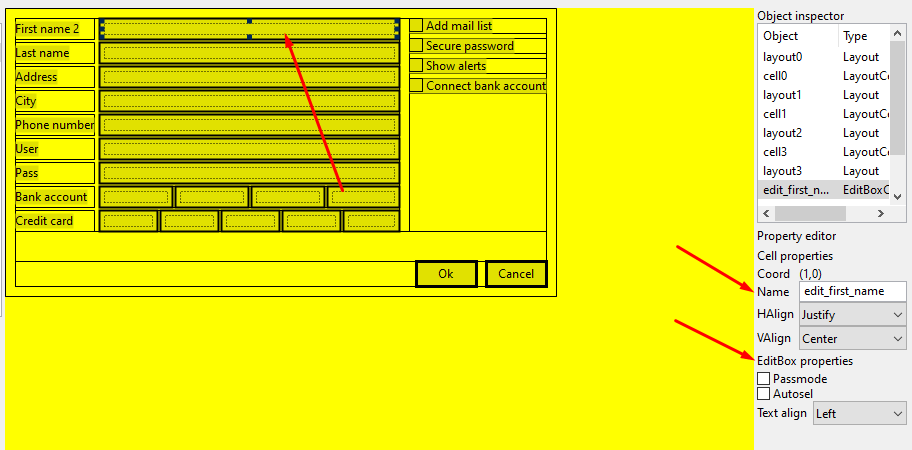
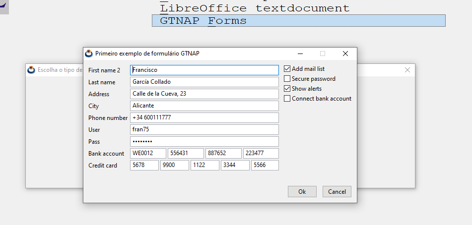

# GTNAP-Forms

GTNAP-Forms is a set of Harbour functions, integrated into GTNAP, that allow us to load and run forms created with [NapDesigner](./Readme.md).

## Build GTNAP-Forms

GTNAP-Forms is built into GTNAP, extending its API, so we don't have to do anything special to compile it. Just run the build script in `contrib\gtnap`. More information at [Build GTNAP](../Readme.md#build-gtnap).

```
cd contrib/gtnap

:: Windows MinGW
build.bat -b [Debug|Release] -comp mingw64

:: Linux/macOS
bash ./build.sh -b [Debug|Release]
```
## Load a form

NapDesigner creates `*.nfm` (NAppGUI forms) files that can be loaded at runtime. In [exemploforms.prg](../tests/cuademo/gtnap_cualib/exemploforms.prg) you have the complete example.

### NAP_FORM_LOAD

Load a form from a file on disk.

```
LOCAL V_FORM := NAP_FORM_LOAD(DIRET_FORMS() + "Customer.nfm")

PAR1: Path to the file containing the form.
RET: Form object.
```

### NAP_FORM_TITLE

Set a title for the form window.

```
NAP_FORM_TITLE(V_FORM, "Primeiro exemplo de formulário GTNAP")

PAR1: Form object.
PAR2: Text string with the title.
```
### NAP_FORM_MODAL

Launch the form in modal mode.

```
N_RES := NAP_FORM_MODAL(V_FORM)

PAR1: Form object.
RET: Numeric value with the result at the close of the form. These values ​​can be:
    - NAP_MODAL_ENTER (2). The form has been closed by pressing the [RETURN] key.
    - NAP_MODAL_ESC (1). The form has been closed by pressing the [ESC] key.
    - NAP_MODAL_X_BUTTON (3). The form has been closed by clicking the [X] icon in the window.
    - OTHER. The form has been closed by NAP_FORM_STOP_MODAL()
```

### NAP_STOP_MODAL

Forces a form launched via `NAP_FORM_MODAL()` to close. This function must be invoked by some callback function, in response to any GUI event (for example, pressing a button).

```
NAP_FORM_ONCLICK(V_FORM, "button_ok", {|| NAP_FORM_STOP_MODAL(V_FORM, 1000) })

PAR1: Form object.
PAR2: Numeric value to return as a response in NAP_FORM_MODAL().
```
## Data binding

To make the form really practical, we need to be able to connect variables in the Harbour part to the GUI controls (widgets). The first thing is to give a unique and recognizable **ID** in NapDesign to the cells that contain the widgets that we are interested in connecting. For example, the _Editbox_ with the user's name (`edit_first_name`).



In the Harbour part, we need to create a vector of pairs (ID-variable). The `ID` is the name of the widget previously assigned in NApDesign, which will be in charge of editing the value of the `variable`.

```
LOCAL C_NAME := "Francisco"
LOCAL C_LAST := "García Collado"
LOCAL C_ADDRESS := "Calle de la Cueva, 23"
LOCAL C_CITY := "Alicante"
LOCAL C_PHONE := "+34 600111777"
LOCAL C_USER := "fran75"
LOCAL C_PASS := "pass5566"
LOCAL C_BANK := {"WE0012", "556431", "887652", "223477"}
LOCAL C_CARD := {"5678", "9900", "1122", "3344", "5566"}
LOCAL L_MAIL_LIST := .T.
LOCAL L_SECURE_PASS := .F.
LOCAL L_SHOW_ALERTS := .T.
LOCAL L_CONNECT_BANK := .F.
// Mapping between Harbour variables and form control names
LOCAL V_BIND := { ;
                    {"edit_first_name", @C_NAME }, ;
                    {"edit_last_name", @C_LAST }, ;
                    {"edit_address", @C_ADDRESS }, ;
                    {"edit_city", @C_CITY }, ;
                    {"edit_phone", @C_PHONE }, ;
                    {"edit_user", @C_USER }, ;
                    {"edit_pass", @C_PASS }, ;
                    {"edit_bank1", @C_BANK[1] }, ;
                    {"edit_bank1", @C_BANK[1] }, ;
                    {"edit_bank2", @C_BANK[2] }, ;
                    {"edit_bank3", @C_BANK[3] }, ;
                    {"edit_bank4", @C_BANK[4] }, ;
                    {"edit_credit1", @C_CARD[1] }, ;
                    {"edit_credit2", @C_CARD[2] }, ;
                    {"edit_credit3", @C_CARD[3] }, ;
                    {"edit_credit4", @C_CARD[4] }, ;
                    {"edit_credit5", @C_CARD[5] }, ;
                    {"check_mail_list", @L_MAIL_LIST }, ;
                    {"check_secure_pass", @L_SECURE_PASS }, ;
                    {"check_show_alerts", @L_SHOW_ALERTS }, ;
                    {"check_connect_bank", @L_CONNECT_BANK } ;
                }
```

**Form running from Harbour**


If the variable is provided by value it will be read-only. We will see its value in the widget, but the value assigned by the user cannot be recorded. To do this, pass the variable by reference.

### NAP_FORM_DBIND

Binds a vector of pairs (id-variable) to the form.

```
NAP_FORM_DBIND(V_FORM, V_BIND)

PAR1: Form object.
PAR2: Pair vector (id-variable)
```

When the form is launched with `NAP_FORM_MODAL()`, the value of the variables will be automatically mapped to the widgets. If the user changes any value, it will NOT be written back until we call `NAP_FORM_DBIND_STORE()`.

### NAP_FORM_DBIND_STORE

Writes content of form widgets in variables provided by `NAP_FORM_DBIND()`

```
IF N_RES == NAP_MODAL_ENTER .OR. N_RES == 1000
    // Write the values from the GUI controls to Harbour variables
    NAP_FORM_DBIND_STORE(V_FORM)

PAR1: Form object.
```

If the variable was passed by value, it will be impossible to record the changes. Pass a reference to the variable to make it read/write.

## Button events

If the Harbor part wants to perform some action if a button is pressed, it will need to associate a block of code with the component.

### NAP_FORM_ONCLICK

Sets the block of code that will be executed when a button is pressed on the form.

```
NAP_FORM_ONCLICK(V_FORM, "button_ok", {|| NAP_FORM_STOP_MODAL(V_FORM, 1000) })

PAR1: Form object.
PAR2: Button ID.
PAR3: Block of code to be executed in the Harbor part.
```

In this example, clicking the button is associated with closing the form with the return code `1000`.
