# NAppGUI designer

NAppGUI Designer es una herramienta visual para diseñar interfaces de usuario (formularios) de forma gráfica e interactiva. Estos formularios se guardarán en archivos que podrán ser cargados en tiempo de ejecución desde Harbour, utilizando GTNAP. Se ha desarrollado utilizando NAppGUI-SDK y los formularios que genera también utilizan NAppGUI para correr dentro de la aplicación final (https://nappgui.com).

## Vista general de NapDesigner

En principio, la apariencia de la aplicación es muy parecida a la de otras herramientas similares (QTDesigner, por ejemplo). En la parte central tendremos el área de diseño donde visualizamos el formulario en construcción. A la izquierda disponemos de una lista de archivos y un selector de widgets. A la derecha tenemos el inspector de objetos y el editor de propiedades. En la parte superior veremos la típica barra de herramientas para la gestión de archivos y una barra de estado en la parte inferior.


## Compilar NapDesigner

Designer se distribuye como parte de GTNAP, por lo que no hay que hacer nada especial para compilarla, tan solo correr el script de build en `contrib\gtnap`. Mas información en [Build GTNAP](../Readme.md#build-gtnap)

```
cd contrib/gtnap

:: Windows MinGW
build.bat -b [Debug|Release] -comp mingw64

:: Linux / macOS
bash ./build.sh -b [Debug|Release]
```
El ejecutable de la aplicación lo podemos encontrar en `build/[Debug|Release]/bin/napdesign`.

## Abrir carpeta de proyecto

La primera vez que arranca la aplicación tendremos un área de dibujo en blanco y todos los botones apagados. Lo primero que tenemos que hacer es pulsar sobre el icono carpeta (📁) y seleccionar un directorio de proyecto. NapDesigner permite editar simultáneamente todos los formularios de dicho directorio. La carpeta actual la podemos ver situando el ratón encima del icono. Haciendo clic sobre cualquier archivo, lo seleccionaremos y veremos en el área de dibujo.

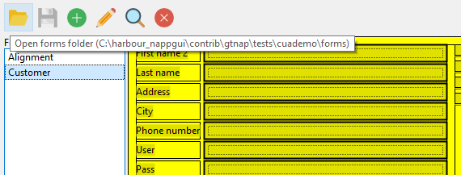

## Crear un nuevo formulario

Una vez abierta la carpeta del proyecto, pulsando el botón (⊕︎) crearemos un nuevo formulario. Tras asignarle nombre, veremos es un pequeño rectángulo en el área de dibujo que representa un layout de una sola celda.

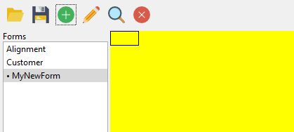

NAppGUI se basa en el concepto de Layout (GridLayout en QtDesigner) que dividirá el espacio en una rejilla de **ncols** x **nrows** celdas. La diferencia con otros SDKs es que NAppGUI **no soporta elementos flotantes**. Todos los widgets deben estar dentro de una celda en un layout. Como veremos a continuación, la principal ventaja de esto radica en que **no es necesario establecer el marco** (posición y tamaño) de cada elemento, ya que será calculado automáticamente por NAppGUI en función del API nativo (Win32, GTK, Cocoa).

### Subdivisión del espacio. Añadir celdas

A partir de aquí deberemos sub-dividir esta primera celda utilizando el componente _Grid Layout_ del selector de widgets. En función de la disposición del panel que estamos editando, haremos unas u otras subdivisiones.

* Selecciona _Grid Layout_, haz clic sobre la celda. Aparecerá un diálogo, donde seleccionados **Columns: 1, Rows: 2, [OK]**.

    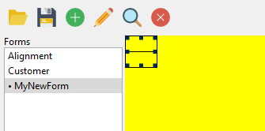

* Vemos que en el _Object Inspector_ se va formando una jerarquía (camino) de Layouts y Cells.

    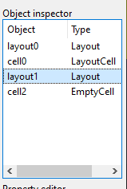

    * **layout0:** Layout principal compuesto de (1x1) celda.
    * **cell0:** Celda [0,0] de layout0.
    * **layout1:** Layout de (1x2) celdas ubicado en cell0 (posición [0,0] de layout0).
    * **cell2:** Celda (0,0) de layout1, por el momento vacía.
    * Profundizaremos más adelante en el _Object Inspector_. Por el momento, vamos observando como cambia el panel a medida que realizamos subdivisiones.

* Manteniendo _Grid Layout_ en el selector de widgets, hacemos click sobre la celda superior y seleccionamos: **Columns: 2, Rows: 1, [OK]**.

    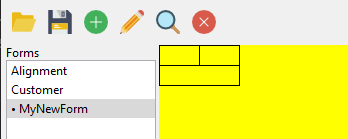

* En la celda superior izquierda, creamos un grid de 2 columnas y 9 filas.

    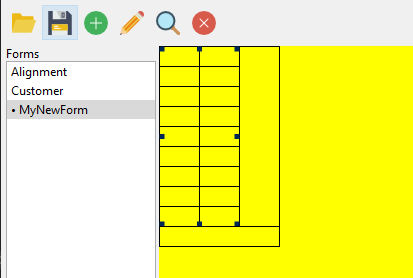

* En la celda de la derecha 1 columna y 4 filas.

    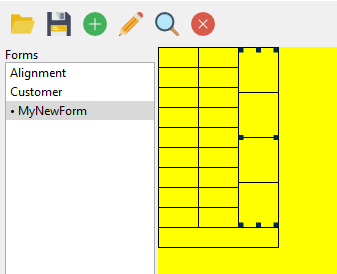

* Y, por último, en la celda inferior, 2 columnas y 1 fila. Con esto, hemos alcanzado la configuración de celdas necesaria para nuestro formulario. Vamos a empezar a insertar contenido.

    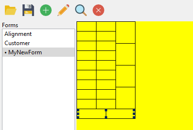

### Añadir Widgets

* Selecciona _Label_ en el selector de widgets. Empezando por la celda superior izquierda, vamos a crear etiquetas para las nueve celdas de la izquierda: `First Name`, `Last Name`, `Address`, `City`, `Phone number`, `User`, `Pass`, `Bank account` y `Credit card`. Verás como los textos más anchos desplazarán a la derecha al resto de celdas. Esto es un efecto de la maquetación automática que realiza NAppGUI.

    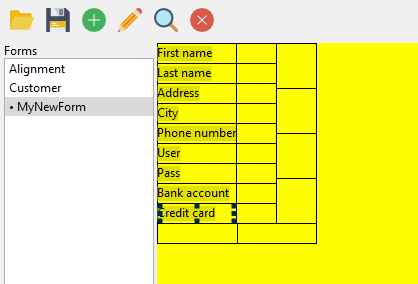

* Selecciona _Editbox_ en el selector de widgets. Vamos a añadir un componente para cada celda a la derecha de los textos, excepto para `Bank account` y `Credit card`. Por el momento, utiliza las opciones por defecto al crear los Editbox.

    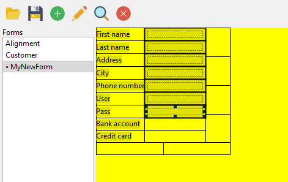

* Para el caso del `Bank account` y `Credit card` queremos separar la entrada en diferentes Editbox. Vuelve a seleccionar _Grid layout_ en el selector de widgets y crea 4 columnas y 1 fila para el `Bank account` y 5 columnas para el `Credit card`. Observarás que el formulario se va expandiendo horizontalmente, por el momento no te preocupes por esto.

    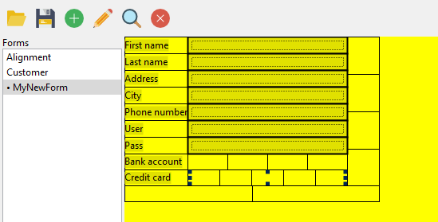

* Añade un _Editbox_ por cada celda del `Bank account` y `Credit card`.

    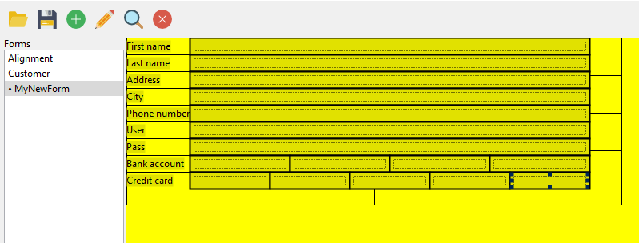

* Selecciona _Button_ en el selector de widgets y añade dos botones `[OK]` y `[Cancel]` en las dos celdas inferiores.

    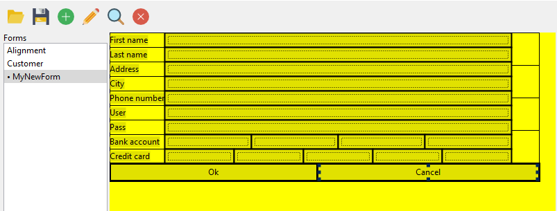

* Por último selecciona _Checkbox_ en el selector de widgets y crea 4 checks en las celdas restantes de la derecha:
    * `Add mail list`.
    * `Secure password`.
    * `Show alerts`.
    * `Connect bank account`.

    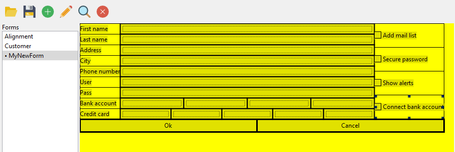

* Para concluir pulsa el botón (🔍) _Simulate current form_ para comprobar el funcionamiento de nuestro formulario, con el diseño que tenemos hasta ahora.

    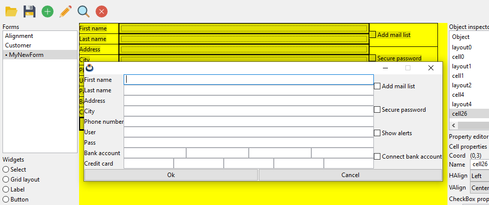

### Márgenes y tamaño máximo

Si bien nuestro formulario es totalmente funcional, no es muy estético. Vamos a darle algo de formato para mejorar su apariencia.

* En el _Object inspector_ selecciona _layout3_, que corresponde al layout de 2 columnas y 9 filas que añadimos antes. En el _Property editor_ selecciona **Column 1** y establece la propiedad **FWidth** (forced width) a 300. Esto "fuerza" la anchura máxima de la columna 1 del layout a 300 píxeles. Los controles interiores se ajustan automáticamente.

    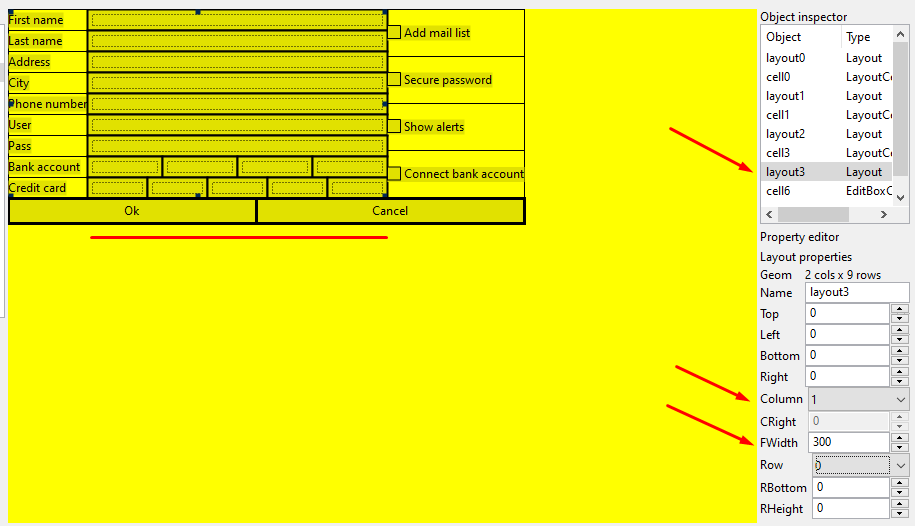

* Ahora vamos a dejar una pequeña separación entre la columna de los _Label_ y la columna de los _Editbox_. Seguimos en _layout3_, selecciona **Column 0** y **CRight** a 5. Esto fuerza una separación de 5 píxeles a la derecha de la columna 0. Como ves, no tienes que ajustar con el ratón la posición de los Editbox. NAppGUI recalcula todo el diseño a partir de los cambios que vayamos realizando.

    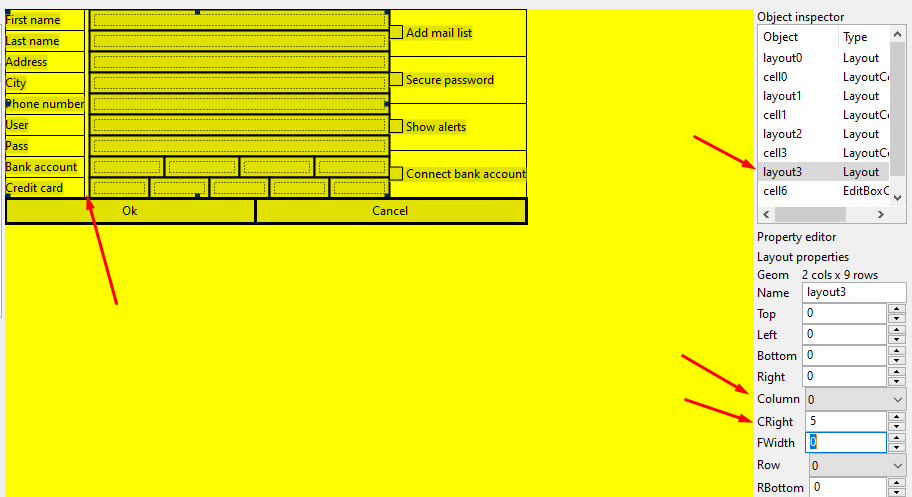

* Selecciona ahora el componente _cell2_, que es la celda inferior que contiene un layout con los dos botones. En el _Property editor_ vemos que aparecen las propiedades de la celda, donde vemos la etiqueta **Layout cell**. Esto significa que en esta celda no tenemos un widget, sino un layout (grid) de 2 columnas y 1 fila con los dos botones. Cambiamos la propiedad **HAlign** a **Right** (en lugar de Justify). Veremos que ambos botones se alinean a la derecha. Por defecto, cuando una celda contiene un sub-layout el contenido se expande para rellenar todo el espacio de la celda.

    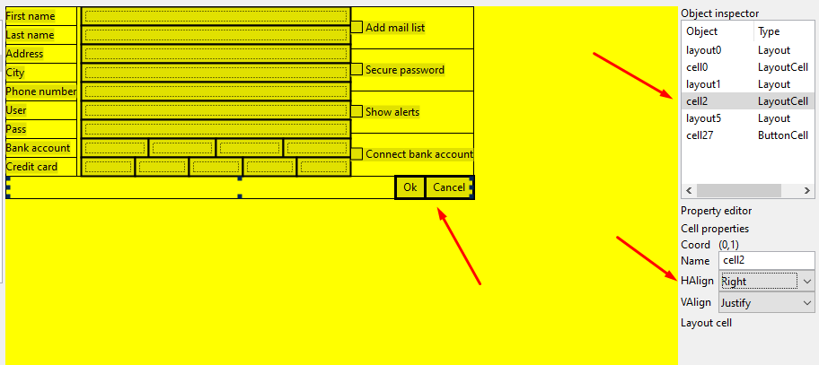

* Selecciona _layout5_ (la rejilla con los dos botones). En **Column 0** establece **FWidth** a 60 y **CRight** a 10. Y en **Column 1**, **FWidth** a 60. Esto aumentará ligeramente el ancho por defecto de los botones y dejará una separación entre ellos de 10 píxeles.

    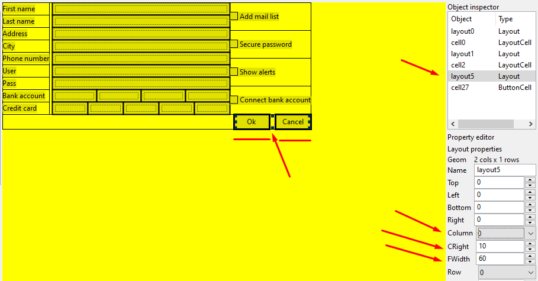

* Selecciona _layout1_, **Row 0**, **RBottom** 30. Esto fuerza una separación vertical entre el área de datos y los botones.

    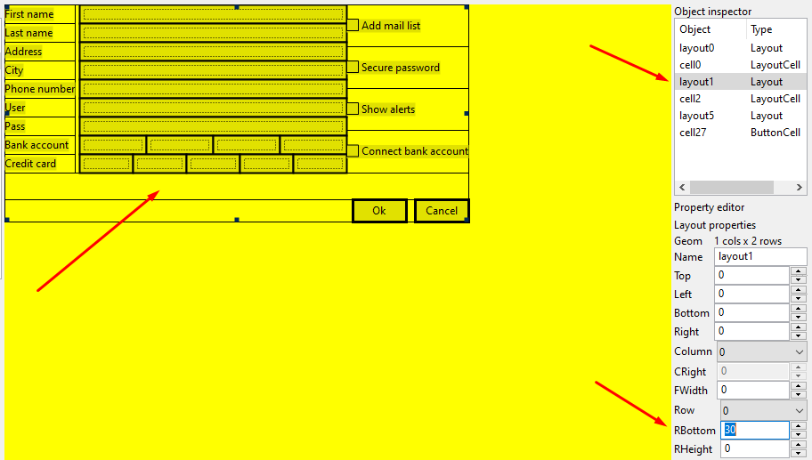

* Vamos ahora a _cell4_, que es la celda que contiene el sublayout con los 4 _Checkbox_. En **VAlign** seleccionamos **Top**. Con esto conseguimos agrupar todos los _Checkbox_ en la parte superior de la celda.

    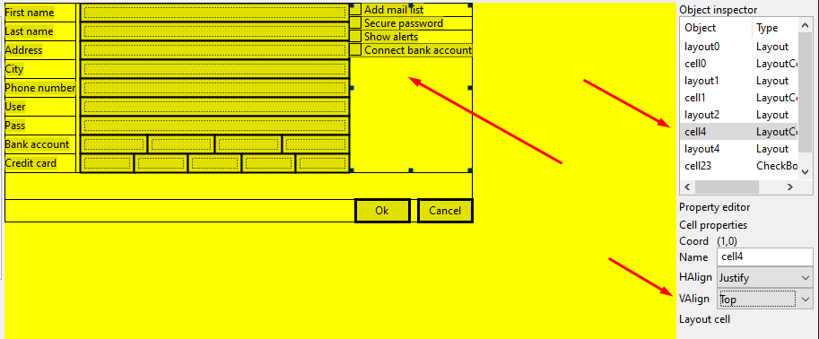

* Para dejar algo de separación entre los _Checkbox_, selecciona _layout4_ y, para **Row 0**, **Row 1** y **Row 2** establece **RBottom** a 5.

    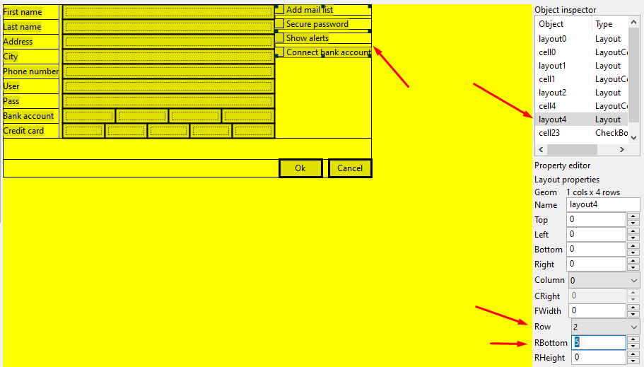

* Ahora, en _layout2_, **Column 0**, **CRight** 10, que dejará una separación horizontal de 10 píxeles entre los _Editbox_ y los _Checkbox_.

    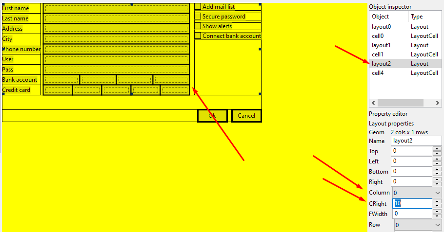

* Queremos dejar una pequeña separación vertical de 3 píxeles entre cada fila _Label_/_Editbox_. Selecciona _layout3_, **Row 0-7**, **RBottom** 3.

    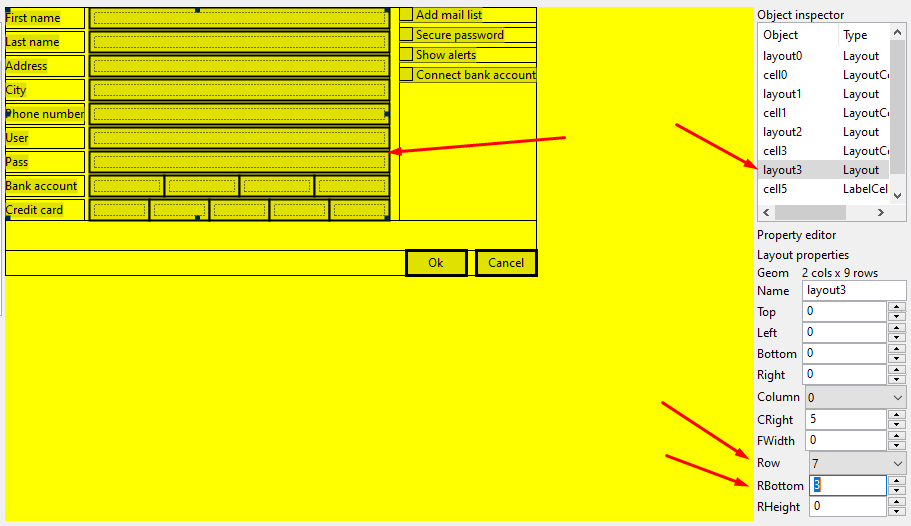

* Y otros tres píxeles horizontales entre cada _Editbox_ del `Bank account` y `Credit card`. Selecciona _layout7_, **Column 0-3**, **CRight** 3 para `Credit card`.

    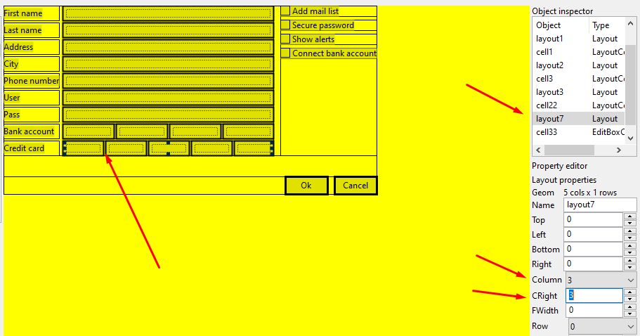

* Y para finalizar vamos a establecer un borde para todo el formulario de 10 píxeles. Selecciona _layout0_ y establece a 10, las propiedades **Top**, **Left**, **Bottom**, **Right**.

    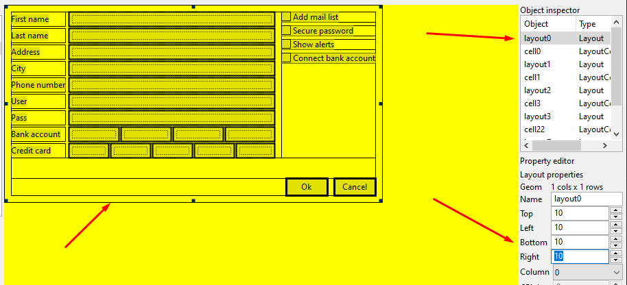

* Pulsa el icono _Simulate current form_ para comprobar el resultado final.

    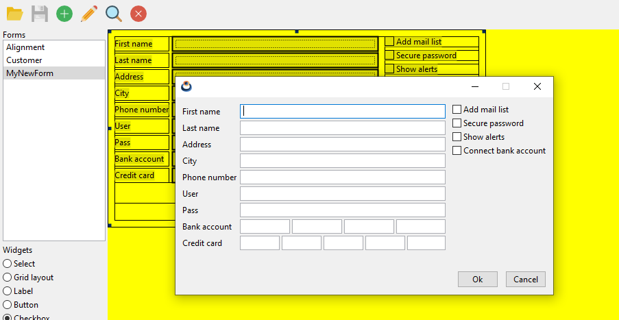
