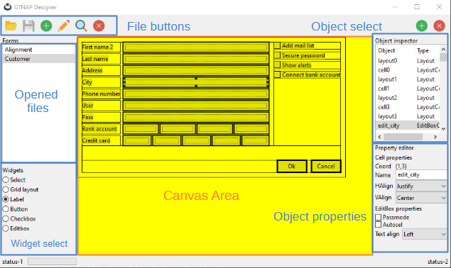

# NAppGUI designer and GTNAP-Forms

NAppGUI Designer es una herramienta visual para diseñar interfaces de usuario (formularios) de forma gráfica e interactiva. Estos formularios se guardarán en archivos que podrán ser cargados en tiempo de ejecución desde Harbour, utilizando GTNAP. Se ha desarrollado utilizando NAppGUI-SDK y los formularios que crea también utilizan NAppGUI para .... dentro de la aplicación final (https://nappgui.com).

## Vista general de Designer

En principio, la apariencia de la aplicación es muy parecida a la de otras herramientas similares (QTDesigner, por ejemplo). En la parte central tendremos el área de diseño donde visualizamos el formulario en construcción. A la izquierda disponemos de una lista de archivos y un selector de widgets. A la derecha tenemos el inspector de objetos y el editor de propiedades. En la parte superior veremos la típica barra de herramientas para la gestión de archivos y una barra de estado en la parte inferior.

