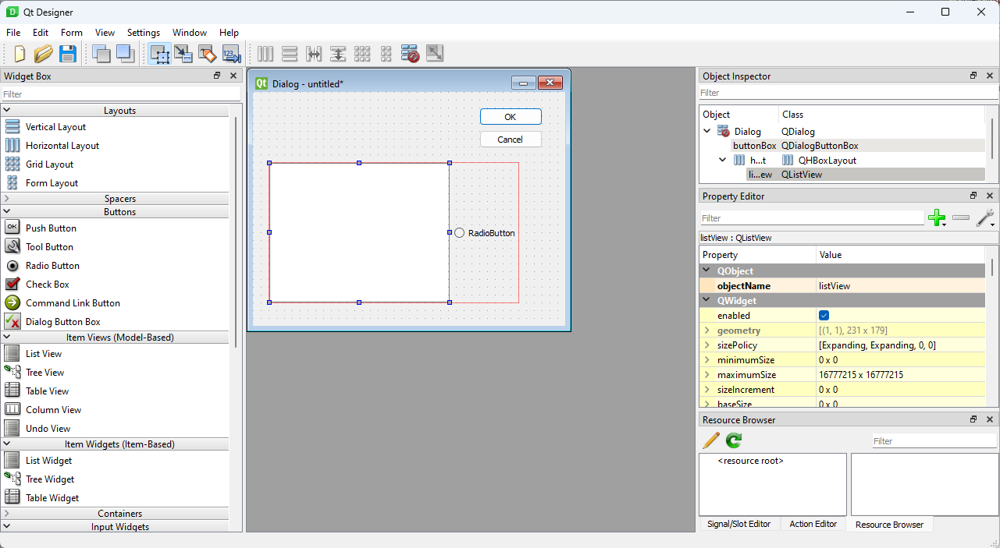
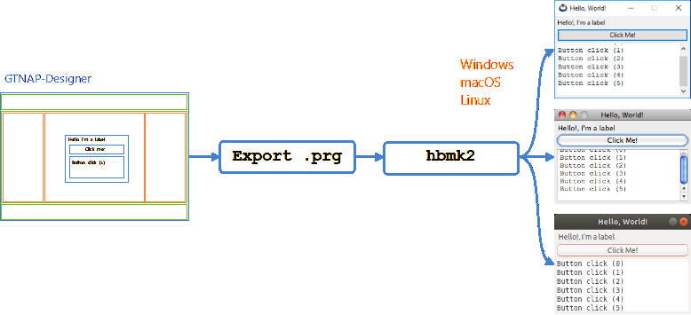
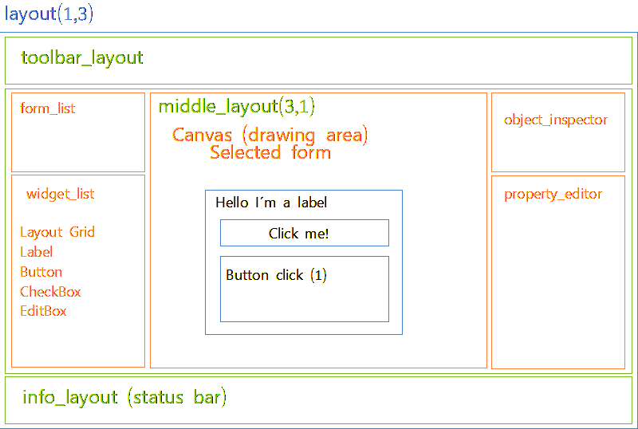
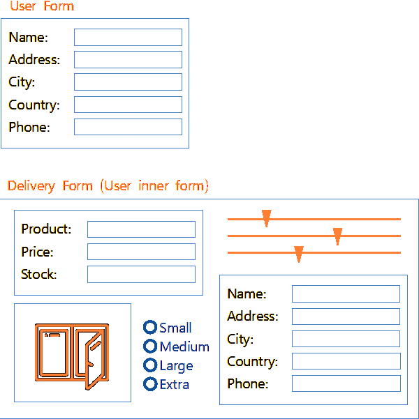
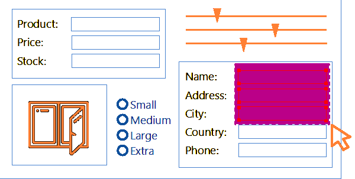
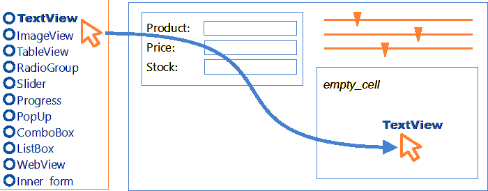
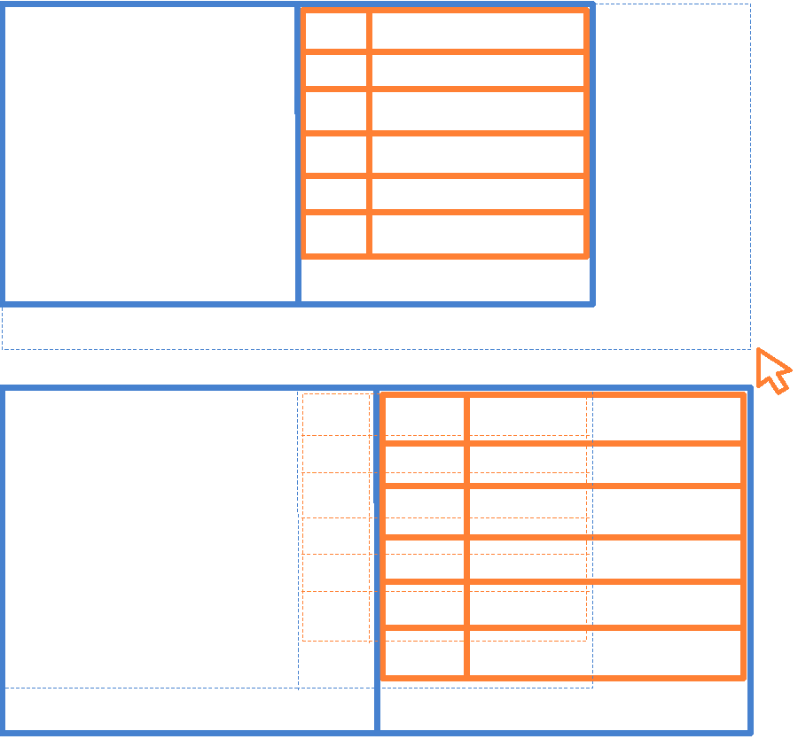

# GTNAP Designer

The objective of this document is to introduce and first plan the GTNAP-Designer tool for the visual design of forms and windows. In principle, this tool is intended to be a "clone" of QT-Designer with some differences:

* GTNAP-Designer will create forms compatible with NAppGUI-SDK.
* The results can be exported to a `.prg` file, in **Harbour** language, therefore compilable by `hbmk2`.
* The generated forms will be cross-platform (Windows, macOS, Linux) and will respect the native _look&Feel_ of each system: Colors, Fonts, Themes, etc.

> **Important:** This document has attempted to estimate all the tasks and times that will be required to successfully complete the project. These deadlines may be affected by decisions that are made on the fly, as the project is developing.

**QT-Designer**



**GTNAP-Designer**



## Planning

The development of a tool of this type is somewhat difficult and it is easy to run into delays and dead ends due to not clearly defining the objectives and functionalities. For this reason we will divide the development into different phases:

* Basic operation (12 Sprints).
* Advanced components (12 Sprints).
* Advanced editing features (9 Sprints).
* Resizable forms (5 Sprints).

## Phase 1: Basic Operation

> **Important** In this phase, an initial and basic version of the tool will be created, with limited editing functionalities. The main objective will be to be able to compose basic forms and export them to Harbour.

After completing this phase we will have:

* Desktop application whose window will be divided into three well-defined areas (same as QtDesigner):
    * Left side: Widgets area, where the elements that we can use for the design are.
    * Central part: Drawing canvas. Where we will design the forms.
    * Right side: Object and properties inspector.
* Elements included in phase 1:
    * Layout (GridLayout at the moment). The grid allows you to create VerticalLayout and HorizontalLayout.
    * Label.
    * Button.
    * CheckBox.
    * EditBox.
* Multi-form editor. Instead of loading forms one by one, the editor will allow you to have multiple files open and switch between them. Something like the "open folder" option of some editors that will load all existing forms in the same folder at the same time.
* Design file **(.ui)**. File with the design of the form that can be opened with the editor. Probably in JSON format.
* Export to Harbour. Generate a **.prg** file with the Harbour code capable of creating the form at runtime.
* Communication with the form: The final application must be able to access the form at runtime: Detect if a button has been pressed, obtain the text from an EditBox, etc.

**GTNAP-Designer Design (Phase 1)**




### Phase 1: Sprint Estimation (12)

* **Sprint 1:** Create the body of the application. Windows, panels, layouts and controls.
* **Sprint 2:** Create the hierarchy of layouts and sublayouts on the canvas.
* **Sprint 3:** Add Label to the canvas. Here common code will be implemented to interact with the different controls.
* **Sprint 4:** Add Button and CheckBox to the canvas.
* **Sprint 5:** Add EditBox to the canvas.
* **Sprint 6:** Be able to save designs to disk. List of forms.
* **Sprint 7:** Object Inspector. Mirror the object hierarchy in the right panel.
* **Sprint 8:** Property Editor. Be able to edit the selected object in the Object Inspector.
* **Sprint 9:** Export to Harbour .prg (1). Generate compileable Harbour code from the form design. This code will reproduce the form at runtime.
* **Sprint 10:** Export to Harbour .prg (2). This task may take up two sprints.
* **Sprint 11:** Runtime integration with Harbour (1). Here a library will be defined to be able to interact with the forms at runtime. For example:
    ```
    // This function is defined in the .prg
    // automatically generated by GTNAP-Designer
    O_Form := NAP_ASPECT_CUSTOMER_DATA_FORM()

    // These functions are defined in GTNAP-FORMS library
    // and used in the application for interact with the form.
    NAP_FORM_ON_BUTTON_CLICK(O_Form, "button1", {|| ShowMessage("Clicked")})
    NAP_FORM_GET_EDIT_TEXT(O_Form, "editCustomerName", @C_CustomerName)
    ```
* **Sprint 12:** Runtime integration with Harbour (2). This task may take up two sprints.

## Phase 2: Advanced Components

In this phase we will expand the widget catalog. We will take advantage of the basic implementation to enrich the forms with additional controls:

* TextView control. To edit long texts and, optionally, apply formats (Font, bold, sizes, etc.). [Link](https://nappgui.com/en/gui/textview.html).
* ImageView control. Be able to insert images into forms. [Link](https://nappgui.com/en/gui/imageview.html).
* TableView control. Add tables and configure their columns (width, resize, header, etc.). [Link](https://nappgui.com/en/gui/tableview.html).
* TreeView control. Add to the table the ability to work with trees.
* Radio Group. Set of radio buttons, where only one of them can be selected. [Link](https://nappgui.com/en/gui/button.html#h1).
* Slider control. [Link](https://nappgui.com/en/gui/slider.html).
* Progress control. [Link](https://nappgui.com/en/gui/progress.html).
* PopUp control. Button with drop-down menu. [Link](https://nappgui.com/en/gui/popup.html).
* ComboBox control. Edit box with dropdown menu. [Link](https://nappgui.com/en/gui/combo.html).
* ListBox control. List box with optional icons and/or checkbox. [Link](https://nappgui.com/en/gui/listbox.html).
* WebView control. Insert a web browser into the form. [Link](https://nappgui.com/en/gui/webview.html).
* Interior forms. Being able to integrate a previously designed form as part of another larger form.
* Drawing view and OpenGL view. **NOT IMPLEMENTED AT THE MOMENT**. It would be necessary to study how to implement the drawing API in Harbour. [Link](https://nappgui.com/en/gui/view.html). [Link](https://nappgui.com/en/ogl3d/ogl3d.html).

**All widgets (Phase 1 and Phase 2)**


**Interior forms**



### Phase 2: Sprint Estimation (12)

* **Sprint 1:** TextView implementation. Add control, add support for **(.iu)** file and Harbour exporter.
* **Sprint 2:** ImageView implementation. Add control, add support for **(.iu)** file and Harbour exporter.
* **Sprint 3 and 4:** TableView implementation. Add control, add support for **(.iu)** file and Harbour exporter. This component is more complicated to integrate, due to the configuration of the columns. Also, we integrate the TreeView mode.
* **Sprint 5:** Radio buttons. They are generated in groups (minimum 2) with their own horizontal or vertical layout. Add controls, add support for **(.iu)** file and Harbour exporter.
* **Sprint 6:** Sliders and progress. Add controls, add support for **(.iu)** file and Harbour exporter.
* **Sprint 7:** Popup. Add control, add support for **(.iu)** file and Harbour exporter.
* **Sprint 8:** ComboBox. Add control, add support for **(.iu)** file and Harbour exporter.
* **Sprint 9:** ListBox. Add control, add support for **(.iu)** file and Harbour exporter.
* **Sprint 10:** WebView. Add control, add support for **(.iu)** file and Harbour exporter.
* **Sprint 11 and 12:** Inner forms. Possibility of selecting a previous form from the editor. Add control, add support for **(.iu)** file and Harbour exporter.

## Phase 3: Advanced editing features

Now with a fully operational application ready to create and edit any type of form, we will focus on improving the usability of the program. The functionalities to be implemented in this phase will be:

* Multiple selection. Be able to select multiple objects with the mouse or by pressing [Ctrl+click].
* Clipboard: Copy, Paste, Cut.
    * Copy the selected graphic objects to the system clipboard.
    * Define communication structures.
    * Paste the graphic objects in an empty cell of the layout.
    * Copy and paste property texts (e.g. button text).
    * Cut function for selected objects.
    * Remove function from selected objects.
* Undo/Redo: Ability to undo and redo changes.
    * Define what types of operations can be undone.
    * Create the Undo/Redo data structures.
    * Implementation.
* Drag'N'Drop. Being able to drag widgets from the left view to the canvas area and link them to a layout cell.
    * Implement Drag'N'Drop support on Windows, macOS, Linux.
    * Implement dragging widgets from the left panel to the canvas.

**Multiple selection**



**Drag'N'Drop support**



### Phase 3: Sprint Estimation (9)

* **Sprint 1:** Multiple selection of objects.
* **Sprint 2 and 3:** Clipboard implementation. Copy, paste and cut the selected objects.
* **Sprint 4, 5, 6:** Undo/Redo.
* **Sprint 7, 8, 9:** Drag'N'Drop support.

## Phase 4: Resizable forms

Until now, all the forms we can design have a fixed size. We may want to make them re-sizable by using the maximize button or dragging the window borders. This requires adding new properties to the layout and its cells in order to recursively manage how the controls will adapt to the size change. More information [Here](https://nappgui.com/en/gui/layout.html#h5) and [Here](https://nappgui.com/en/demo/die.html#h4).

* Add to the Property Editor those properties necessary to handle the size change.
* Create a "preview" capable of accepting window resizing.
* Modify the **(*.ui)** file to accept these new properties.
* Modify the exporter to **(*.prg)** so that it generates the re-sizable forms.
* Add new functions to handle re-sizing to the GTNAP-Forms library.

**Resizing of forms**



### Phase 4: Sprint Estimation (5)

* Sprint 1: Add new properties to the Property Editor.
* Sprint 2: Create the re-sizable "preview".
* Sprint 3: Modify the **(*.ui)**.
* Sprint 4: Change the exporter to **(*.prg)**.
* Sprint 5: Modify the GTNAP-Forms library.

